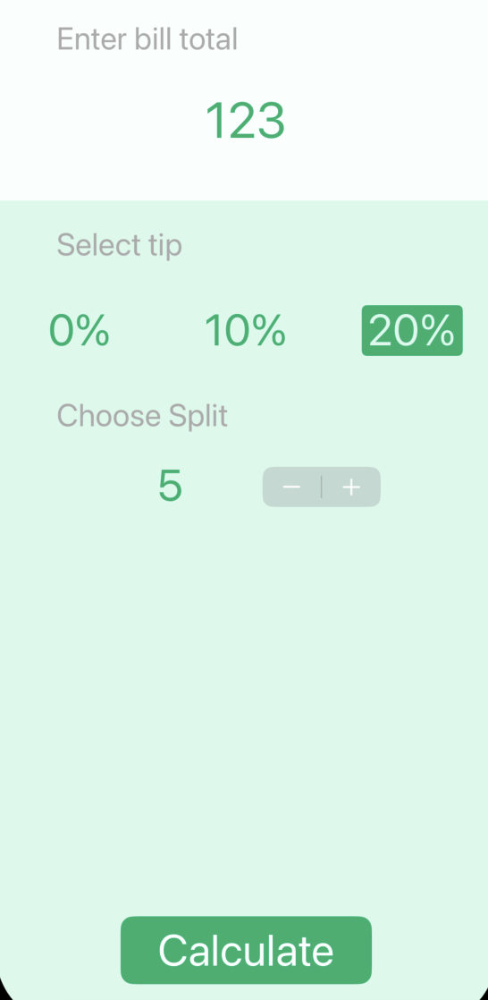
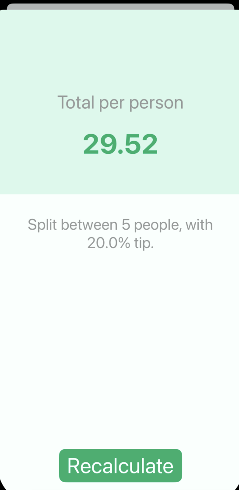

# Tipsy

### A simple iOS/iPadOS split bill calculator app

## Used technologies and tools

- Swift
- UIKit

*This project was developed as part of The Complete iOS App Development Bootcamp by London App Brewery*

*Minimum supported OS version is 13.0*

## Illustrations

### Main screen:

### Result screen:

